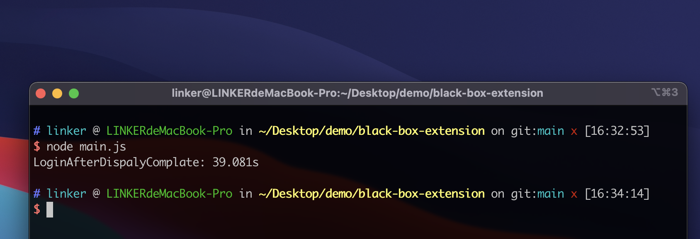

# A test extension way to try

### Run

1. clone project
2. npm install
3. touch .env file

   LOGIN_USER_EMAIL=xxxx

   LOGIN_USER_PWD=xxxx

   TEST_AMAZON_URL=https://www.amazon.com/s?k=baby&js_check_need_popup=1

   PUPPETEER_EXECUTABLE_PATH=/Applications/Google Chrome.app/Contents/MacOS/Google Chrome

   RELATIVE_EXT_PATH=/../../work/extension-pro/jsp/dist/5.19.4/chrome_jsp

4. run result - [video](https://www.loom.com/share/c93824cd9181422481c74afe3141ada7?sharedAppSource=personal_library)

   
